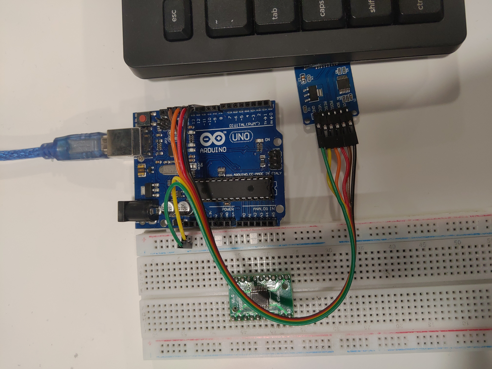

arduino-uno-sd-card
===================

### Notes
- SD card library intentionally only support "8.3 filename" to save memory
  - [8.3 filename - Wikipedia](https://en.wikipedia.org/wiki/8.3_filename)
- button must be debounced. it is required to connected to digital pin 2 which is for external interrupt
